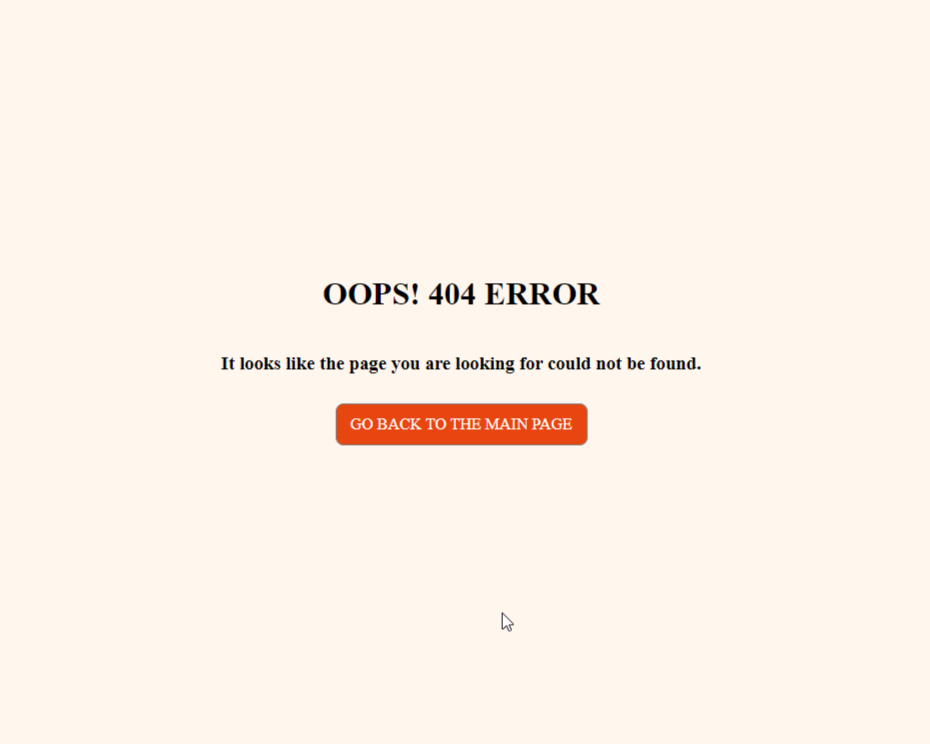

# The Hangman Game

Welcome to the classic word-guessing game of Hangman! Prepare to put your vocabulary skills to the test as you attempt to unravel the mystery word letter by letter. With each incorrect guess, a piece of the hangman's gallows is added, bringing you one step closer to his impending fate. But with wit and strategy, you can outsmart the gallows and reveal the hidden word before it's too late. Are you ready to accept the challenge and become the master of words? Let the guessing begin!

See the deployed project here → [The Hangman Game](https://pp3-the-hangman-game-a071f31abd98.herokuapp.com/)

## Project Goals

A hangman game, aside from providing entertainment and enjoyment, serves as an exercise to stimulate logical thinking, creativity, and vocabulary development. It's a great way to practice deduction skills and strategy while having fun trying to guess words and phrases. Additionally, the hangman game can also be used as an educational tool, especially in learning environments, to teach spelling, vocabulary, and reinforce recognition of linguistic patterns.

## Flowchart

I have create a flowchart to offer me visual representation of the processes I would like to implement in the project. It helped me to break down complex problems into smaller, allowing for a systematic approach.

## Features

The application starts out very simple, by instructing the player to select a category in order to start the game to discover a word.

If the player enters any character that is not a number and is not within the shown range, they will receive a warning to choose a correct category.

When the player chooses the desired category, a random word will be given to them and they will then see various underscores according to the number of characters in the word, the category of the word and an input telling them to guess a letter. A gallows will also be shown, just like in the original game.

If a letter is matched, the player will receive a message informing them that one of the letters of the word has been found, but if the player gets it wrong, they will be warned that the letter is incorrect and that they have a few attempts left and a limb will be attached to the body of the hanged man.

Whenever the player tries to enter two or more letters together, symbols, numbers, whitespace or any other character that is not a single letter, they will be warned that this action cannot be performed.

When the player completes the word, a congratulatory message will be displayed, as well as a question asking if they would like to play again.

However, if the player uses all their attempts and doesn't guess the word correctly, the game will be over. They will also be asked if they want to play again.

If the player chooses to play again, they will be taken back to the category selection. If they choose not to play again, the game will end and they will see the "thank you for playing" message.

In addition to the python project I also created a simple 404 error page.

## Technologies Used
- Python to develop this project.
- [Random](https://docs.python.org/3/library/random.html) library to generate randomness in the project.
- [Colorama](https://pypi.org/project/colorama/) to style the text in the terminal.
- [Git](https://git-scm.com/) for version control.
- [GitPod](https://www.gitpod.io/) as IDE to create this project.
- [GitHub](https://github.com/) to store files for the website.
- [Lucidchart](https://www.lucidchart.com/) to create the flowchart.
- [Heroku](https://www.heroku.com/) to deploy this project.
- [Python Tutor](https://pythontutor.com/) to debug my code.
- [Python Validator](https://pep8ci.herokuapp.com/#) by Code Institute to catch some errors and validate my code.

## Deployment

The application has been deployed from GitHub to Heroku by following the steps:

1. Create or log in to your account at [Heroku](https://www.heroku.com/).
2. Create a new app, add a unique app name and then choose your region.
3. Click on create app.
4. Go to "Settings".
5. Under Config Vars add a key "PORT" and value "8000".
6. Add required buildpacks (further dependencies). For this project, set it up so Python will be on top and Node.js on bottom.
7. Go to "Deploy" and select "GitHub" in "Deployment method".
8. To connect Heroku app to your Github repository code enter your repository name, click "Search" and then "Search" when it shows below.
9. Choose the branch you want to build your app from.
10. If preferred, click on "Enable Automatic Deploys", which keeps the app up to date with your GitHub repository.
11. Wait for the app to build. Once ready you will see the “App was successfully deployed” message and a "View" button to take you to your deployed link.

## Tests

Performed tests can be found in [TESTING.md](TESTING.md).

## Bugs

The project was submitted without any bugs found, however before submission, the following problems were fixed:

| Issue | Fix |
| :--- | :--- |
| The colors added with Colorama would appear in the terminal, but not in the deployed project. | Added Colorama to requirements.txt document. |
| Colorama would color all the code, not just the area it was supposed to color. | Added `Fore.RESET` after every colorama addition to stop the color spreading. |

## Credits

### Learning Methods and Code Used

* [W3Schools](https://www.w3schools.com/) and the [Python official documentation](https://docs.python.org/3/index.html) were used for general queries and as references to check syntax for coding.
* [Kite](https://youtu.be/m4nEnsavl6w?si=Ui5F1RSyijoSaqpE) and [Shaun Halverson](https://youtu.be/pFvSb7cb_Us?si=YHWWJJYFXczljek3) videos helped me with the hangman game's functions.
* With [Tech With Tim](https://youtu.be/u51Zjlnui4Y?si=xJkWXebLSjXS8wOq)'s video I learned how to work with Colorama.
* To debug my project and to fix some minor errors after validation I looked for tips on [Stack Overflow](https://stackoverflow.com/).

### Content

I requested [Chat GPT](https://chat.openai.com/) to generate lists of words I could use in the game.

### Acknowledgments

I would like to acknowledge:

- Kay Welfare - My cohort facilitator.
- Jubril Akolade - My Code Institute mentor.