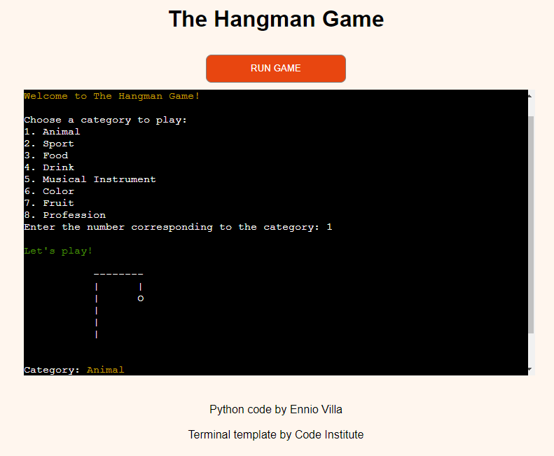

# Testing

See the deployed project here → [The Hangman Game](https://pp3-the-hangman-game-a071f31abd98.herokuapp.com/)

## Manual Testing

Tests were carried out during the creation of the project and at the end a general test was carried out to ensure that the program was working correctly.

| Section | Action | Result |
| --- | --- | --- |
| Category | The player must select a category using numbers within the range | Works as expected |
| Category | The player cannot input letters | Works as expected |
| Category | The player cannot input symbols | Works as expected |
| Category | The player cannot input whitespace | Works as expected |
| Category | The player cannot press enter without choosing a number | Works as expected |
| Guess word | The player must input a letter | Works as expected |
| Guess word | The player cannot input numbers | Works as expected |
| Guess word | The player cannot input symbols | Works as expected |
| Guess word | The player cannot input whitespace | Works as expected |
| Guess word | The player cannot input more than one letter | Works as expected |
| Guess word | The number of attempts changes as the player makes mistakes | Works as expected |
| Guess word | The hanged man's body is completed if the player makes mistakes | Works as expected |
| Play again | The player must input 'yes' or 'no' to play again | Works as expected |
| Play again | The player cannot input any letters or words other than 'yes' or 'no' | Works as expected |
| Play again | The player cannot input numbers | Works as expected |
| Play again | The player cannot input symbols | Works as expected |
| Play again | The player cannot input whitespace | Works as expected |
| Play again | Take the player back to the category selection if 'yes' is entered | Works as expected |
| Play again | End the game if 'no' is entered | Works as expected |

## Browser Testing

| Broswer | Result |
| --- | --- |
| Chrome | Works as expected |
| Edge | Works as expected |
| Firefox | Works as expected |
| Opera | Works as expected |